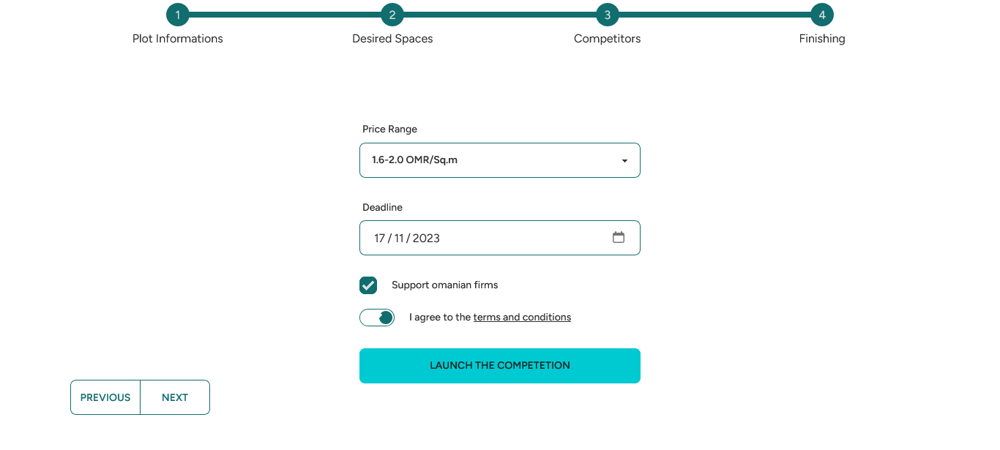

  ## Introduction

Ce projet vise à créer une plateforme en ligne pour faciliter la construction de maisons sur mesure. Les clients pourront déposer leurs demandes de maisons personnalisées, tandis que les agences de construction pourront acheter ces offres à un prix symbolique. Les clients auront la possibilité de comparer les offres des différentes agences et de choisir celle qui correspond le mieux à leurs besoins.

This project aims to create an online platform to facilitate the construction of custom homes. Clients will be able to submit their requests for personalized homes, while construction agencies can purchase these offers at a symbolic price. Clients will have the ability to compare offers from different agencies and choose the one that best suits their needs.

## Brief Breakdown

There is two type of users and view: the client view and the company view, let's start with the client view:

The user can use **create project** button to creat a project representing the home requirements that will be competited upon by companies, he will be then redirected to a page when he can fill the requirements step by step:

Now the project is created is visible by companies/agencies of construction which can then send diffrent offers.

6company-dashboard.png

Lets now move on to the company view and try to send an offer.

in the dashboard we have projects which our company involved in, now lets add the newly created project, for that we will move to the projects section in which agencies can find projects open for submissions:

Its now in our dashboard and we can view it's details:

Lets say we finished our sketching this fast and now we will send the offer to our lucky client :

we fill the details and click **send offer** and now our client will see our offer ( or any other agency that have sent their offer)

the client can choose the desired offer and that's ours of course.

now the only thing left is for the client to contact the company throught his prefered medium

